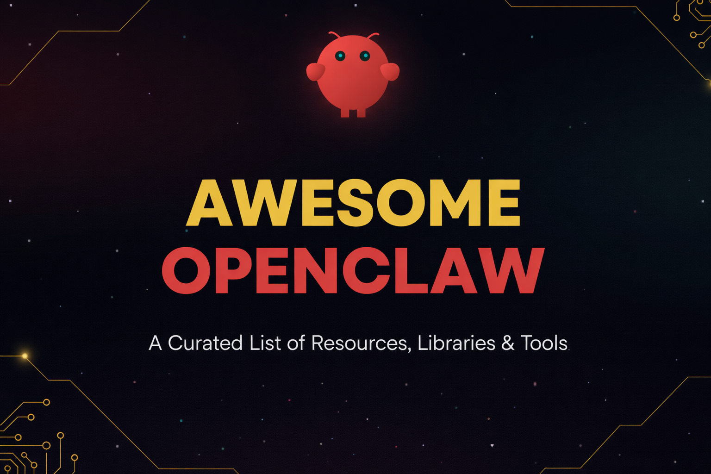

<!-- title -->

<!--lint ignore no-dead-urls-->

# Awesome OpenClaw   

<!-- description -->

_A curated list of awesome [OpenClaw](https://openclaw.ai/) resources — community projects, tools, skills, integrations, and examples for the open-source personal AI assistant._ 🦞

<!-- image -->

---

[OpenClaw](https://github.com/openclaw/openclaw) is an open-source personal AI assistant you run on your own devices. It connects to the channels you already use (WhatsApp, Telegram, Slack, Discord, Signal, iMessage, and more), features voice capabilities, and offers a live Canvas for visual interactions.

---

## Contents

- [📌 Official Resources](#-official-resources)
- [🌐 Community](#-community)
- [🔗 Related Projects](#-related-projects)
- [🚀 Contributors](#-contributors)

---

## 📌 Official Resources

Official projects and documentation from the OpenClaw team.

| Resource                                                        | Description                                              |
| --------------------------------------------------------------- | -------------------------------------------------------- |
| [OpenClaw](https://github.com/openclaw/openclaw)                | The main open-source repository                          |
| [Documentation](https://docs.openclaw.ai/)                      | Official documentation and guides                        |
| [ClawHub](https://clawhub.com/)                                 | Official skills registry for discovering and sharing     |
| [Discord](https://discord.gg/clawd)                             | Official Discord server for support and discussions      |
| [DeepWiki](https://deepwiki.com/openclaw/openclaw)              | AI-generated documentation wiki                          |

---

## 🌐 Community

Places to connect with other OpenClaw users and contributors.

| Community                                                                                   | Description                        |
| ------------------------------------------------------------------------------------------- | ---------------------------------- |
| [Discord Server](https://discord.gg/clawd)                                                  | Official chat with 50k+ members    |
| [GitHub Discussions](https://github.com/openclaw/openclaw/discussions)                      | Q&A and feature discussions        |
| [Reddit r/OpenClaw](https://reddit.com/r/openclaw)                                          | Community subreddit                |
| [Lemmy c/openclaw](https://lemmy.ml/c/openclaw)                                             | Fediverse community                |
| [Matrix Space](https://matrix.to/#/#openclaw:matrix.org)                                    | Decentralized chat on Matrix       |

---

## 🔗 Related Projects

Projects that complement or are related to OpenClaw.

### AI Assistants

| Project                                                                     | Stars                                                                  | Description                              |
| --------------------------------------------------------------------------- | ---------------------------------------------------------------------- | ---------------------------------------- |
| [Claude Code](https://github.com/anthropics/claude-code)                    |         | Terminal-based AI coding assistant       |
| [Open Interpreter](https://github.com/OpenInterpreter/open-interpreter)     |  | Natural language interface for computers |
| [Aider](https://github.com/paul-gauthier/aider)                             |            | AI pair programming in your terminal     |

### Supporting Projects

| Project                                                       | Stars                                                              | Description                             |
| ------------------------------------------------------------- | ------------------------------------------------------------------ | --------------------------------------- |
| [Pi-mono](https://github.com/badlogic/pi-mono)                |           | Agent runtime that powers OpenClaw      |
| [Baileys](https://github.com/WhiskeySockets/Baileys)          |     | WhatsApp Web API used by OpenClaw       |
| [grammY](https://github.com/grammyjs/grammY)                  |            | Telegram Bot framework used by OpenClaw |

### Similar Awesome Lists

| List                                                                                    | Stars                                                                     | Description               |
| --------------------------------------------------------------------------------------- | ------------------------------------------------------------------------- | ------------------------- |
| [Awesome Claude Code](https://github.com/hesreallyhim/awesome-claude-code)              |  | Resources for Claude Code |
| [Awesome ChatGPT](https://github.com/sindresorhus/awesome-chatgpt)                      |      | ChatGPT resources         |
| [Awesome LLM Apps](https://github.com/Shubhamsaboo/awesome-llm-apps)                    |     | LLM application examples  |
| [Awesome Generative AI](https://github.com/steven2358/awesome-generative-ai)            |  | Generative AI resources   |

---

## 🚀 Contributors

A huge thank you to all our amazing contributors!

Your contributions make this project better every day.

⭐ A special shoutout to all our [stargazers](https://github.com/NipunaRanasinghe/awesome-openclaw/stargazers) for your support!
**Star this repository** to stay updated and help grow the community!

---

## Contributing

Your contributions are welcome! Here's how to get started:

- Fork the [repository](https://github.com/NipunaRanasinghe/awesome-openclaw/fork) and clone it locally.
- Add your resource to the appropriate section in `README.md`.
- Ensure the resource is:
  - Relevant to OpenClaw.
  - Actively maintained (updated within the last 6 months).
  - Includes a brief description and link.
- Submit a pull request with a clear description of your changes.

For more details, see the [CONTRIBUTING.md](CONTRIBUTING.md) guide.

---

## License

To the extent possible under law, the contributors have waived all copyright and related or neighboring rights to this work.
